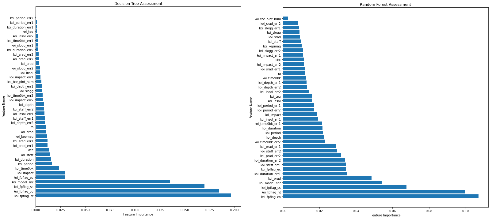

# machine-learning-exoplanets
UofA Data Analytics Bootcamp Homework Assignment 21-Machine-Learning

### Assignment Description
Used NASA Kepler space telescope measurement data to classify exoplanet candidates.  Multiple machine learning model types were explored to learn how to implement and assess which model is the best fit for this data set.  The best fit model required an accuracy score at at least 0.85 and reasonable training time.

### Tools Utilized
Python, Pandas, sklearn, tensorflow

### Project Content Descriptions
* a_instructions: Instructions, data and starter code for completing the assignment.
* b_source_data:
    * exoplanet_data.csv: Data provided by UofA Data Analytics Bootcamp. 
    * archive: Copies of the full data set from NASA and Kaggle as reference. I chose to continue analysis with the partially cleaned data provided by UofA Data Analytics Bootcamp.  Note, the NASA data set includes descriptive column name information.
* c_ feature_selection: Decision tree and random forest analyses were performed to determine if a smaller subset of features would produce better results by limiting overfitting conditions.
* d_regression: Linear Regression and Logistic Regression analyses were performed for 3 sets of input features.
* e_SVC: SVC analysis was performed for 3 sets of input features.
* f_NN: Sequential 1-layer neural network analyses were performed for 3 sets of input features.
* g_deep_learning: Sequential 2-layer neural network analysis was performed for the full set of features.
* images: Feature assessment plots.
* bestFit_SVC*: Jupyter notebook and joblib save files for the model of best fit. Note, these files duplicate the results of the e_SVC folder. 
* model_assessment.csv: Table of model scores.
* LICENSE: MIT License Disclosure

### Best Fit Model Selection
The analysis began with a review of feature importance results from decision tree and random forest models. This was done to investigate possible areas of over-fitting the data.  Initially it appeared that the knee seen in feature importance might be large enough to warrant restricting features in further model development. However, restricting features in model training based on this assessment did not ultimately improve model performance.    

The decision tree assessment highlighted 4 features with importance measurements exceeding 0.125 with a split value of 0.1. While the random forest assessment included one additional feature but yielded a split value of only 0.02.

The next phase of the analysis was to develop and tune various model types to determine which set of features and parameters yielded the best results.  Note, that all models were trained and tested with a same 70/30 split of the source data.  The accuracy results for each model were as follows.

| Model Type | Input Features | Test Data Accuracy Score | Hyperparameter Tuning Speed |
|----------------|----------------|----------------|---------------:|
| tensorflow.keras.models.Sequential (1-layer) | Option 2: No error measurements | 0.894 | Slow |
| tensorflow.keras.models.Sequential (2-layer) | Option 1: Full | 0.893 | Slow |
| tensorflow.keras.models.Sequential (1-layer) | Option 1: Full | 0.886 | Slow |
| sklearn.svm.SVC  | Option 1: Full | 0.874 | Medium |
| sklearn.linear_model.LogisticRegression | Option 1: Full | 0.847 | Fast |
| tensorflow.keras.models.Sequential (1-layer) | Option 3: Assessed features of importance | 0.814 | Slow |
| sklearn.svm.SVC  | Option 2: No error measurements | 0.806 | Medium |
| sklearn.linear_model.LogisticRegression | Option 2: No error measurements | 0.802 | Fast |
| sklearn.linear_model.LogisticRegression | Option 3: Assessed features of importance | 0.739 | Fast |
| sklearn.svm.SVC  | Option 3: Assessed features of importance | 0.714 | Medium |
| sklearn.linear_model.LinearRegression | Option 1: Full | 0.475 | Fast |
| sklearn.linear_model.LinearRegression | Option 2: No error measurements | 0.456 | Fast |
| sklearn.linear_model.LinearRegression | Option 3: Assessed features of importance | 0.429 | Fast |

Overall, the best models (accuracy > 0.85) utilized the full set of features and were built upon either a neural network (NN) or a support vector classification (SVC) algorithm.  The only exception is the 1-layer Sequential NN model that also performed well with error measurements removed from the data set.  Tuning and training the NN models took a significant amount of time (~1hr) to gain 1-2 percent accuracy over the SVC model.

The model of best fit balanced speed and accuracy for the NASA Kepler exoplanet data.  That model was the SVC model trained with all data features and the following tuned parameters:
* kernel: 'linear'
* C: 10
* gamma: 0.0001

The overall testing data score met the model accuracy requirement at 0.874.  An additional metric for consideration with the SVC model was the "Candidate" recall score. The aim of this model is to identify measurement data records that are viable exoplanet candidates that warrant further investigation by scientists for final confirmation.  Higher recall scores indicate the presence of fewer False Negatives.  This model provides both high accuracy, high recall and processing speed and was chosen as the model of best fit.

                        precision    recall  f1-score   support

        CONFIRMED       0.81      0.65      0.72       504
        FALSE POSITIVE  0.74      0.85      0.79       574
        CANDIDATE       0.98      1.00      0.99      1020

        accuracy                            0.87      2098
        macro avg       0.85      0.83      0.84      2098
        weighted avg    0.88      0.87      0.87      2098

### Model Load Instructions
1.  

### Source Data and Starter Code
* Starter code and data provided by UofA Data Analytics Bootcamp
* Project inspiration from Kaggle at <a href="https://www.kaggle.com/nasa/kepler-exoplanet-search-results" target="_blank">https://www.kaggle.com/nasa/kepler-exoplanet-search-results</a>
* Original NASA Kepler space telescope data set from <a href="https://exoplanetarchive.ipac.caltech.edu/cgi-bin/TblView/nph-tblView?app=ExoTbls&config=koi" target="_blank">https://exoplanetarchive.ipac.caltech.edu/cgi-bin/TblView/nph-tblView?app=ExoTbls&config=koi</a>
* Keras hyperparameter tuning code example from <a href="https://machinelearningmastery.com/grid-search-hyperparameters-deep-learning-models-python-keras/" target="_blank">https://machinelearningmastery.com/grid-search-hyperparameters-deep-learning-models-python-keras/</a>
